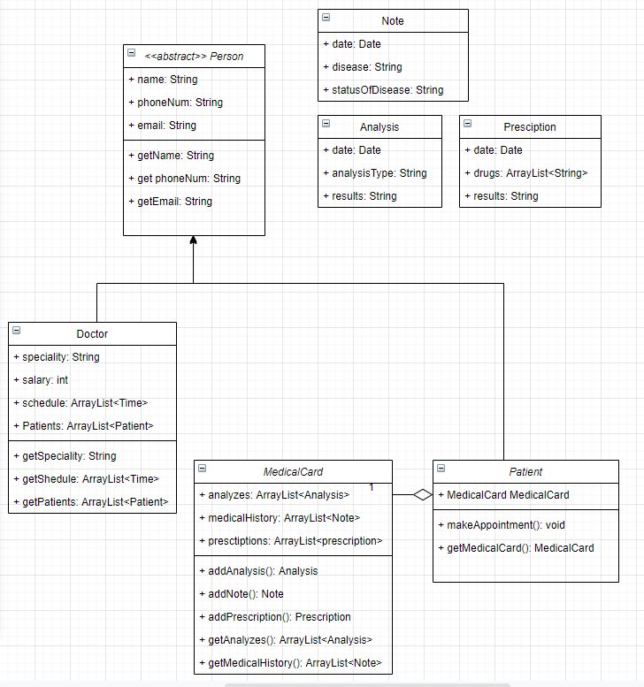

# Прототип медицинской информационной системы
Прототип медицинской информационной системы основан на взаимодействии двух главных элементов: Врач и Пациент.
* Оба класса наследуются от единого класса Person с основной информацией о человеке.
* Пациент имеет медицинскую карту, в которую заносится его история болезней, анализы и врачебные рецепты.
Создаются отдельные структуры данных для их описания.
* Вся информация сохраняется в текстовые файлы (наверное...)
* Пациент может записаться к врачу исходя из его расписания (schedule). В таком случае пациент заносится в список пациентов врача.
Врач имеет право редактировать медицинскую карту пациента.
* У врача определена специальность и, соответственно, зарплата.

UML-диаграмма прототипа:

